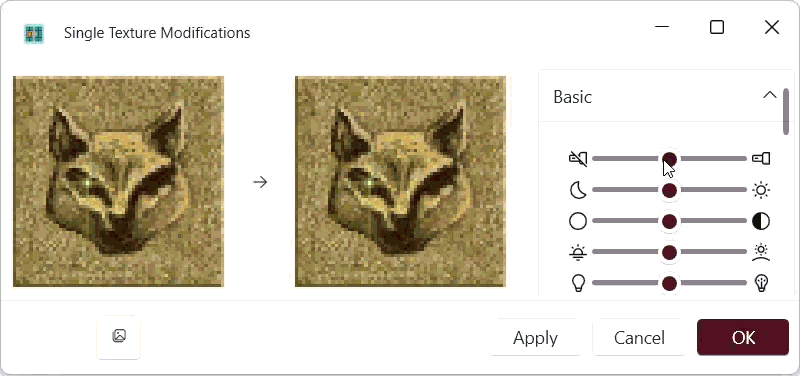
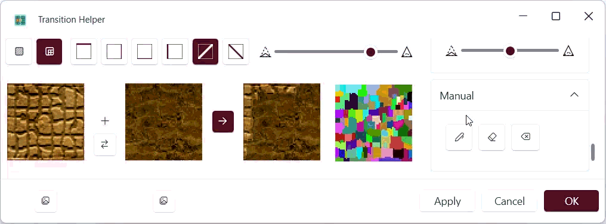

# TgaBuilder
### **Texture Panel Building Tool for TRLE**

[Latest Releases](https://github.com/JohnnyJF10/TgaBuilder/releases) | [GitHub Page](https://johnnyjf10.github.io/TgaBuilder/)

## Description

TgaBuilder is a Texture Panel Building tool for TRLE, which facilitates the process of texture panel creation. The tool is inspired by TBuilder by IceBerg but programmed from scratch in .NET, C# WPF for Windows and Avalonia UI (cross-platform, experimental).

If you have already worked with TBuilder in the past, you should get familiar with TgaBuilder very quickly. It covers most of the features TBuilder has and introduces several more, most prominently:

- Texture Panel Panning and Zooming
- Undo / Redo
- Window Resizable
- Extended dimensioning with panel heights up to 128 pages, panel widths up to 16 pages
- Better support for 128×128 or 256×256 px texture sets
- Batch Loader to create texture panels from multiple single texture files at once
- Imported texture repacking to remove TE compiled atlas padding
- **Transition Helper Windows** (Smooth & Brick) for generating transition tiles
- **Modifications Window** for non-destructive image adjustments
- and others…

---

## 📖 Documentation

| Guide | Description |
|-------|-------------|
| [Installation](Manuals/Installation.md) | Download links, system requirements, platform setup |
| [Main Controls](Manuals/MainControls.md) | All panels, tabs, mouse/keyboard controls, and shortcuts |
| [Modifications & Transitions](Manuals/ModificationsAndTransition.md) | Modifications window, Smooth transitions, Brick transitions with all segmentation algorithms and filters |

---

## Quick Start

1. **Download** the latest release from [GitHub Releases](https://github.com/JohnnyJF10/TgaBuilder/releases)
2. **Extract** and run `TgaBuilder.exe` (Windows) or `dotnet TgaBuilderAvaloniaUi.dll` (Linux)
3. Open a source texture panel (`Ctrl + E`) and a destination panel (`Ctrl + D`)
4. Pick tiles from source and place them on the destination
5. Save your texture panel (`Ctrl + S`)

For detailed instructions, see the [Installation Guide](Manuals/Installation.md).

---

## License

This project is licensed under the MIT License.

### Third-Party Libraries

For WPFZoomPanel, bzPSD and ColorPicker, I did a significant amount of custom modifications, so it was not sufficient to just add them as NuGet packages. These modified projects are included in this repository as well. bzPSD has been modernized to .NET Core and is fully integrated into the TgaBuilderLib assembly. WPFZoomPanel and ColorPicker have own assemblies.

| Package                          | Version  | Source      | License              | Project URL                                                          |
|----------------------------------|----------|-------------|----------------------|----------------------------------------------------------------------|
| *WPF UI version:*                |          |             |                      |                                                                      |
| WPF UI                           | 4.0.3    | NuGet       | MIT                  | [GitHub](https://github.com/lepoco/wpfui)                            |
| WPFZoomPanel                     | -        | GitHub      | MIT                  | [GitHub](https://github.com/Moravuscz/WPFZoomPanel)                  |
| ColorPicker                      | 1.0.11   | GitHub      | MIT                  | [GitHub](https://github.com/icsharpcode/SharpZipLib)                 |
| Microsoft Dependency Injection   | 9.0.9    | NuGet       | MIT                  | [Microsoft](https://dotnet.microsoft.com/en-us/)                     |
| *Avalonia UI version:*           |          |             |                      |                                                                      |
| Avalonia UI                      | 12.0.2   | Avalonia UI | MIT                  | [Avalonia UI](https://avaloniaui.net/)                               |
| PanAndZoom                       | 12.0.0.1 | NuGet       | MIT                  | [GitHub](https://github.com/wieslawsoltes/PanAndZoom)                |
| Microsoft Dependency Injection   | 9.0.9    | NuGet       | MIT                  | [Microsoft](https://dotnet.microsoft.com/en-us/)                     |
| *Core Library:*                  |          |             |                      |                                                                      |
| Pfim                             | 0.11.4   | NuGet       | MIT                  | [GitHub](https://github.com/nickbabcock/Pfim)                        |
| bzPSD                            | -        | GitHub      | BSD-3-Clause         | [GitHub](https://github.com/DsonKing/System.Drawing.PSD)             |
| SharpZipLib                      | 1.4.2    | NuGet       | MIT                  | [GitHub](https://github.com/icsharpcode/SharpZipLib)                 |

I would like to express my gratitude to the [TombEditor](https://github.com/MontyTRC89/Tomb-Editor) team and the authors of [TRosettaStone](http://xproger.info/projects/OpenLara/trs.html). Their impressive public contributions immensely helped me understand the TR level file format.

## Contributing

Contributions are welcome! If you find a bug or have a feature request, please open an [issue](https://github.com/JohnnyJF10/TgaBuilder/issues).  
If you want to contribute code, feel free to fork the repository and create a pull request.

## Support

If you have any issues, please open a [GitHub Issue](https://github.com/JohnnyJF10/TgaBuilder/issues).
