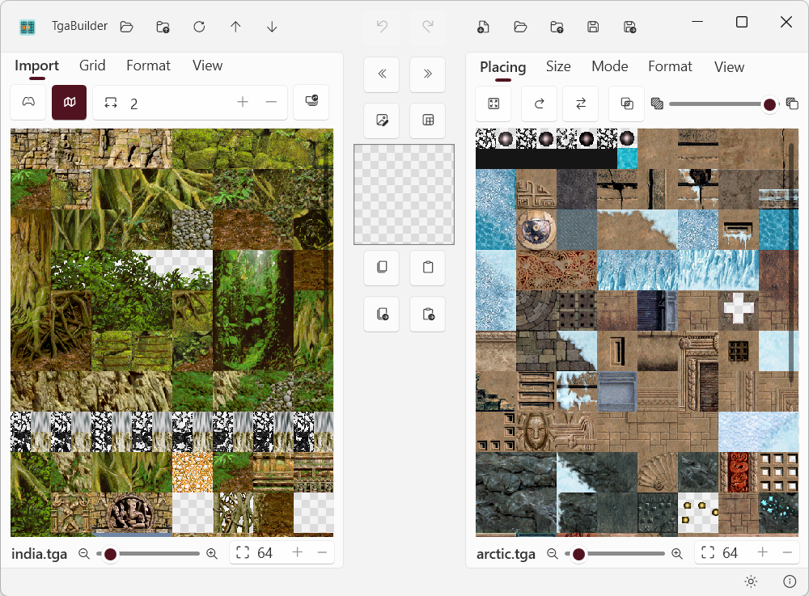
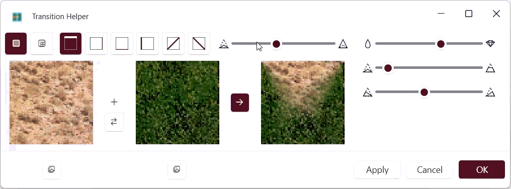
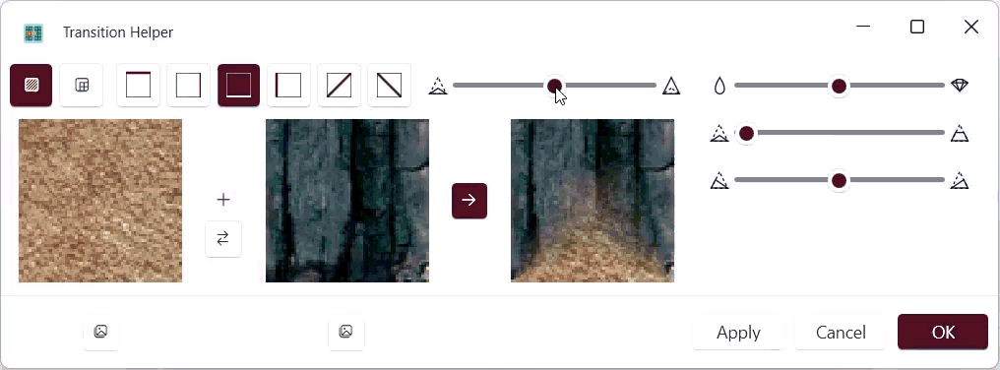
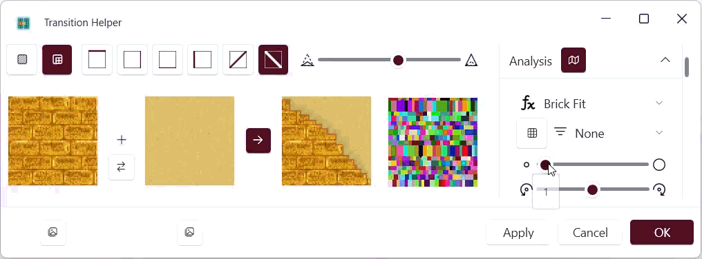

# TrLynx
### **Texture Panel Building Tool for TRLE**

[Latest Releases](https://github.com/JohnnyJF10/TrLynx/releases) | [GitHub Page](https://johnnyjf10.github.io/TrLynx/)

## Description

TrLynx is a Texture Panel Building tool for TRLE, which facilitates the process of texture panel creation. The tool is inspired by TBuilder by IceBerg but programmed from scratch in .NET, C# WPF for Windows and Avalonia UI (cross-platform, preview).

Formerly known as TgaBuilder.

If you have already worked with TBuilder in the past, you should get familiar with TrLynx very quickly. It covers most of the features TBuilder has and introduces several more, most prominently:

- Texture Panel Panning and Zooming
- Undo / Redo
- Window Resizable
- Extended dimensioning with panel heights up to 128 pages, panel widths up to 16 pages
- Better support for 128×128 or 256×256 px texture sets
- Batch Loader to create texture panels from multiple single texture files at once
- Imported texture repacking to remove TE compiled atlas padding
- **Transition Helper Windows** (Smooth & Brick) for generating transition tiles
- **Modifications Window** for non-destructive image adjustments
- and others…

---

## Documentation

| Guide | Description |
|-------|-------------|
| [Installation](docs/Installation.md) | Download links, system requirements, platform setup |
| [Main Controls](docs/MainControls.md) | All panels, tabs, mouse/keyboard controls, and shortcuts |
| [Modifications & Transitions](docs/ModificationsAndTransition.md) | Modifications window, Smooth transitions, Brick transitions with all segmentation algorithms and filters |
| [Third-Party Licenses](docs/ThirdPartyLicenses.md) | All third-party library licenses and attributions |

---

## Quick Start

> If you have Windows 10/11 and either Tomb Editor version 1.9 or later or the .NET 6 runtime installed, use the standard version. Otherwise, use one of the Avalonia preview versions. 

1. **Download** the latest release from [GitHub Releases](https://github.com/JohnnyJF10/TrLynx/releases)
2. **Extract** and run `TrLynx.exe` (Windows) or `TrLynx` (Linux)
3. Open a source texture panel (`Ctrl + E`) and a destination panel (`Ctrl + D`)
4. Pick tiles from source and place them on the destination
5. Save your texture panel (`Ctrl + S`)

For detailed instructions, see the [Installation Guide](docs/Installation.md).

---

## License

This project is licensed under the MIT License. See [LICENSE.txt](LICENSE.txt).

For third-party library licenses and attributions, see [Third-Party Licenses](docs/ThirdPartyLicenses.md).

## Contributing

Contributions are welcome! If you find a bug or have a feature request, please open an [issue](https://github.com/JohnnyJF10/TrLynx/issues).  
If you want to contribute code, feel free to fork the repository and create a pull request.

## Support

If you have any issues, please open a [GitHub Issue](https://github.com/JohnnyJF10/TrLynx/issues).
