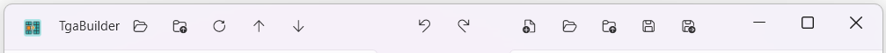
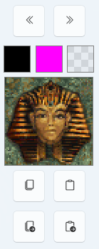
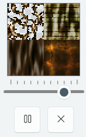
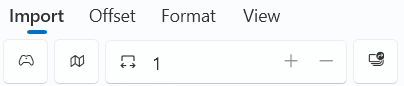
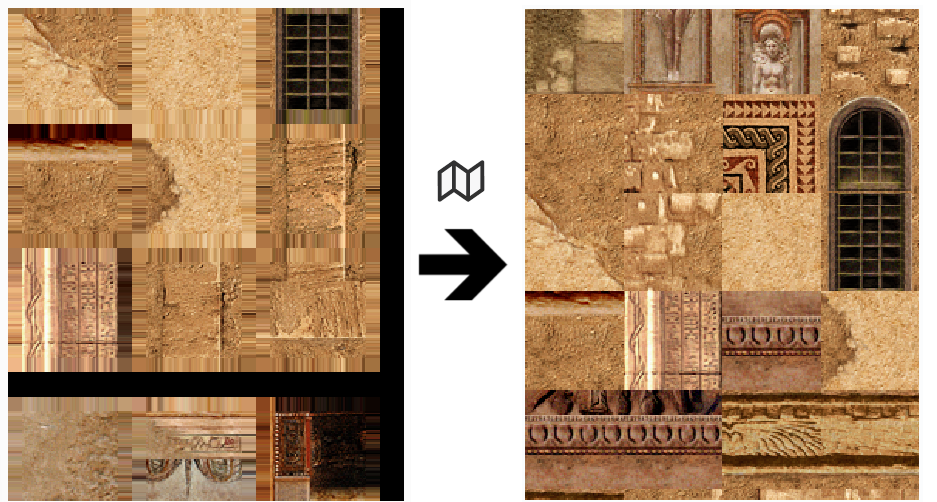
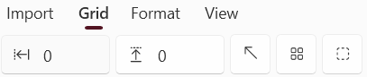
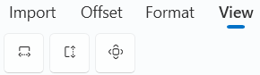
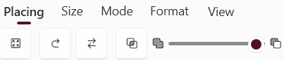
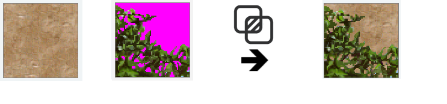

# TgaBuilder
### **Texture Panel Building Tool for TRLE**

## Description
TgaBuilder is a Texture Panel Building tool for TRLE, which is intended to facilitate the process of texture panel creation. The tool is inspired by TBuilder by IceBerg but programmed from scratch in .net 8, C# WPF by me. 

If you have already worked with TBuilder in the past, you should get familiar with TgaBuilder very quickly. It should cover most of the features TBuilder also has and introduces a few things more, most prominently:
- Texture Panel Panning and Zooming
- Undo / Redo
- Window Resizable
- Extended dimensioning with panel hights up to 128 pages, panel widths up to 4 pages
- Better support for 128x128 or 256x256 pix texture sets
- Batch Loader to create texture panels from multiple single texture files at once
- Imported texture repacking to remove TE compiled atlas padding
- and others…

## Installation
Download the latest release from [GitHub Releases](https://github.com/JohnnyJF10/TgaBuilder/releases) and extract the files.

### Requirements
- Windows 10/11
- .net 8 runtime installed

Please note that, as a .net WPF tool, TgaBuilder has significantly higher system resource requirements, particularly for RAM, than TBuilder, which was written in Delphi. If you are still satisfied using TBuilder, please continue using it. TgaBuilder is not intended as a substitute for it.

## Usage

### Title Bar

#### Source Loading

- Open image files as source texture panel  
  _Supported formats:_ **TGA, DDS, PNG, BMP, JPG, JPEG, PSD** (`Ctrl + E`)
  - ... or simply **drop** a supported image file on source panel.
- Reopen recently used source image files

#### Undo / Redo

- Undo: `Ctrl + Z`
- Redo: `Ctrl + Y`

#### Destination Loading / Saving

- Create a new texture panel: `Ctrl + N`
- Open image files as destination texture panel  
  _Supported formats:_ **TGA, DDS, PNG, BMP, JPG, JPEG, PSD** (`Ctrl + D`)
  - ... or simply **drop** a supported image file on destination panel.
- Reopen recently used destination image files
- Save the destination texture  
  _Supported formats:_ **TGA, DDS, PNG, BMP, JPG, JPEG** (`Ctrl + S`)
- Save to a specified file  
  _Formats:_ **TGA, DDS, PNG, BMP, JPG, JPEG** (`Ctrl + Shift + S`)

### Source Panel (Left)

- **Left click** a tile: copy into selection
- **Left click + drag**: copy area into selection
- **Right click** a tile: preview UV rotate (river rotate)
- **Right click + drag**: preview range-based animation of `AnimRange`
- **Left click + Alt + drag**: copy ignoring grid
- **Left click + Ctrl + drag**: move panel
- **Mouse wheel**: scroll vertically
- **Mouse wheel + Ctrl**: zoom in/out

### Destination Panel (Rigth)

#### Picking Mode

- **Left click**: copy into selection or apply transformation
- **Left click + drag**: copy area into selection
- **Right click**: preview UV rotate
- **Right click + drag**: preview animation range

#### Placing Mode

- **Left click**: place selected tile and return to picking
- **Right click**: return to picking without placing

#### General Controls

- **Left click + Ctrl + drag**: move panel
- **Mouse wheel**: scroll vertically
- **Mouse wheel + Ctrl**: zoom

### Selection Area

- Fill selection with chosen color 
- Copy selection to clipboard (`Ctrl + C`)
- Paste clipboard into selection (`Ctrl + V`)
- Auto-copy new selections to clipboard
- Auto-paste clipboard into selection when it has new image data

### AnimationArea

- Set animation speed
- Start / stop animation
- Close animation preview

### Import Tab (Source Panel)

From left to rigth:
- Import atlas from Classic TR levels  
  _Supports:_ **TR1–TRC, TRLE, TRNG, partially TEN (v1.7+)** (`Ctrl + Q`)
- Enable remapping for imports (removes padding in TE-built atlases)

- Set horizontal page count (1, 2, 4, 8, 16 pages)

- Open Batch Loader (`Ctrl + W`)

Please use Imports carefully and conscientiously when building own custom levels.
Specifically, clarify with the creator whether you are authorised to use custom assets.
If in doubt, use assets that are guaranteed to be acceptable for use in your own custom levels instead.
Please also note that this tool is licensed under the MIT licence.

### Batch File Loader

- Import multiple image files from folder  
  _Supported formats:_ **TGA, DDS, PNG, BMP, JPG, JPEG**
- Select or reopen folder
  - ... or simply **drop** a set of supported image files on preview panel.
- Set Range:
  - **First Texture Index**
  - **Number of Textures**
- Define square resize size for textures

### Grid Tab (Source Panel)

From left to rigth:
- Toggle grid on/off
- Change layout
- Set picker size: **8, 16, 32, 64, 128, 256 px**

### Offset Tab (Source Panel)

From left to rigth:
- Set **X offset**
- Set **Y offset**
- Reset offset

### Alpha Tab (Source Panel)

From left to rigth:
- Restore original image
- Replace selected color with **magenta**
- Use eyedropper to set color to replace
- Auto-apply magenta replacement for new selections

### View Tab (Source and Destination Panel)

From left to rigth:
- Fit panel **width** to viewport
- Fit panel **height** to viewport
- Set zoom to **100%**

### Placing Tab (Destination Panel)

From left to rigth:

From left to rigth:
- Set target picker size: **8, 16, 32, 64, 128, 256 px**
- Enable transparent overlay (do not draw magenta/alpha 0 to destination)

- Enable **Swap and Place** mode (put replaced tile into selection)
- Enable **Resize to Picker** mode (resize selection to destination picker size)

### Size Tab (Destination Panel)

From left to rigth:

- Set destination panel **height** (in pages, max 128 pages)
- Set destination panel **width** (in pages, possible values 1, 2, 4, 8 or 16 pages)
- Enable texture **rearranging during width changes**

### Mode Tab (Destination Panel)

Same functions as in TBuilder.
From left to rigth:

- Standard tile placing
- Rotate tile
- Mirror tile **horizontally**
- Mirror tile **vertically**
- **Tile Rally mode**: move one tile and shift all tiles inbetween
- **Swap Tile mode**: swap two tiles

### Keyboard Shortcuts
| Key Combination    | Description                                               |
|--------------------|-----------------------------------------------------------|
| Ctrl + A           | Create a new texture panel                                |
| Ctrl + C           | Copy selection to clipboard                               |
| Ctrl + V           | Paste from clipboard to selection                         |
| Ctrl + Z           | Undo                                                      |
| Ctrl + Y           | Redo                                                      |
| Ctrl + S           | Save destination texture panel                            |
| Ctrl + Shift + S   | Save destination texture panel to new / other file        |
| Ctrl + E           | Open source texture panel                                 |
| Ctrl + D           | Open destination texture panel                            |
| Ctrl + Q           | Import from TR Level                                      |
| Ctrl + W           | Open batch loader                                         |

## Limitations

- The application is currently limited to use **24 bpp pixel formates** for the destination texture panel. All incoming requests to modify image areas on the setination panel will be converted to 24bpp if they are not already. The color representing transparency is (r,g,b) = (255,0,255) as usual in TRLE; alpha = 0 areas will be converted to this color automatically.
- The height of any bitmap/texture panel handled by this tool is currently capped at **32,768 px** or **128 pages** (~256 px length per page). This limitation is required to avoid issues with the .NET WPF Bitmap containers.
- The height is always a **multiple of 256 px**, the standard TR page width, to ensure divisibility by picker sizes.
- Current supported destination texture panel widths: **256, 512, 1024, 2048, 4096 px** (corresponding to 1, 2, 4, 8, and 16 pages).
- Current supported picker sizes: **8, 16, 32, 64, 128, 256 px**
- Image files that do not meet these requirements will be **automatically expanded or cropped**.

## License
This project is licensed under the MIT License.

### Third-Party Libraries

For WPFZoomPanel I did some custom modifications and adapted it to .net 8. This modified project is included in this reporsitory as well.

| Package                          | Version | Source | License               | Project URL                                               |
|----------------------------------|---------|--------|-----------------------|-----------------------------------------------------------|
| WPFZoomPanel                     | -       | GitHub | MIT                   | [GitHub](https://github.com/Moravuscz/WPFZoomPanel)       |
| Pfim                             | 0.11.3  | NuGet  | MIT                   | [GitHub](https://github.com/nickbabcock/Pfim)             |
| bzPSD                            | 0.1.0   | NuGet  | BSD-3-Clause license  | [GitHub](https://github.com/DsonKing/System.Drawing.PSD)  |
| WPF UI                           | 4.0.3   | NuGet  | MIT                   | [GitHub](https://github.com/lepoco/wpfui)                 |
| Microsoft Dependency Injection   | 9.0.6   | NuGet  | MIT                   | [Microsoft](https://dotnet.microsoft.com/en-us/)          |
| SharpZipLib                      | 1.4.2   | NuGet  | MIT                   | [GitHub](https://github.com/icsharpcode/SharpZipLib)      |

<PackageReference Include="SharpZipLib" Version="1.4.2" />

I would like to express my gratitude to the [TombEditor](https://github.com/MontyTRC89/Tomb-Editor) team and the authors of [TRosettaStone](http://xproger.info/projects/OpenLara/trs.html). Their imppressive public contributions immensely helped me understanding the TR level file format. 

## Contributing
Contributions are welcome! If you find a bug or have a feature request, please open an [issue](https://github.com/JohnnyJF10/TgaBuilder/issues).  
If you want to contribute code, feel free to fork the repository and create a pull request.

## Support
If you have any issues, please open a [GitHub Issue](https://github.com/JohnnyJF10/TgaBuilder/issues).  

## To Do List:
- Optimize the memory management during Classic TR level Import
- Support **32 bpp pixel formates** for the destination panel as well
- Fix bugs
- Migrate from WPF to Win UI 3 or Avalonia
