# Main Controls

## Title Bar

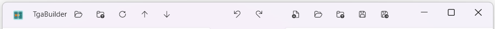

### Source Loading

- Open image files as source texture panel  
  _Supported formats:_ **TGA, DDS, PNG, BMP, JPG, JPEG, PSD** (`Ctrl + E`)
  - … or simply **drop** a supported image file on the source panel.
- Reopen recently used source image files
- Reload the current file in case of changes to load settings (Import Tab) or file changes
- Open previous file in current folder
- Open next file in current folder

### Undo / Redo

- Undo: `Ctrl + Z`
- Redo: `Ctrl + Y`

### Destination Loading / Saving

- Create a new texture panel: `Ctrl + N`
- Open image files as destination texture panel  
  _Supported formats:_ **TGA, DDS, PNG, BMP, JPG, JPEG, PSD** (`Ctrl + D`)
  - … or simply **drop** a supported image file on the destination panel.
- Reopen recently used destination image files
- Save the destination texture  
  _Supported formats:_ **TGA, DDS, PNG, BMP, JPG, JPEG** (`Ctrl + S`)
- Save to a specified file  
  _Formats:_ **TGA, DDS, PNG, BMP, JPG, JPEG** (`Ctrl + Shift + S`)

---

## Source Panel (Left)

- **Left click** a tile: copy into selection
- **Left click + drag**: copy area into selection
- **Right click** a tile: preview UV rotate (river rotate)
- **Right click + drag**: preview range-based animation of `AnimRange`
- **Left click + Alt + drag**: copy ignoring grid
- **Left click + Ctrl + drag**: move panel
- **Mouse wheel**: scroll vertically
- **Mouse wheel + Ctrl**: zoom in/out

---

## Destination Panel (Right)

### Picking Mode

- **Left click**: copy into selection or apply transformation
- **Left click + drag**: copy area into selection
- **Right click**: preview UV rotate
- **Right click + drag**: preview animation range
- **Middle click**: move to Placing Mode directly

### Placing Mode

- **Left click**: place selected tile and return to picking
- **Right click**: return to picking without placing

### General Controls

- **Left click + Ctrl + drag**: move panel
- **Mouse wheel**: scroll vertically
- **Mouse wheel + Ctrl**: zoom
- **Mouse wheel + Shift**: change picker size

---

## Selection Area

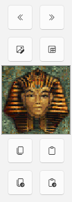

- Click the **Preview Image** to manually switch to Placing Mode on the Destination Panel
- Buttons to copy entire contents from Source to Destination panels or vice versa
- Fill selection with chosen color
- Copy selection to clipboard (`Ctrl + C`)
- Paste clipboard into selection (`Ctrl + V`)
- Auto-copy new selections to clipboard
- Auto-paste clipboard into selection when it has new image data
- Open **Smooth Transition Helper** and **Brick Transition Helper** from the center action buttons to combine two selections and generate transition results quickly

---

## Animation Area

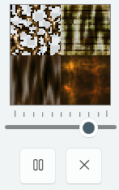

- Set animation speed
- Start / stop animation
- Close animation preview

---

## Import Tab (Source Panel)

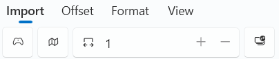

From left to right:
- Import atlas from Classic TR levels  
  _Supports:_ **TR1–TRC, TRLE, TRNG, TEN** (`Ctrl + Q`)
- Enable remapping for imports (removes padding in TE-built atlases)

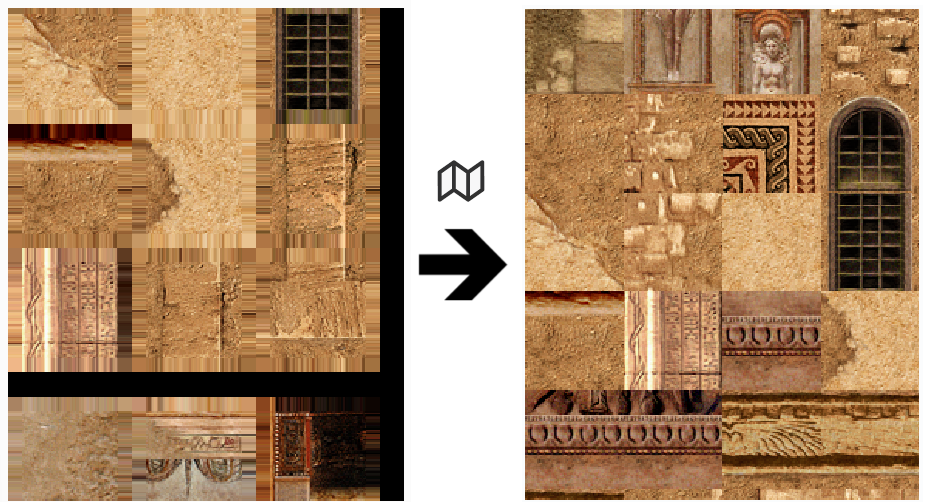

- Set horizontal page count (1, 2, 4, 8, 16 pages)

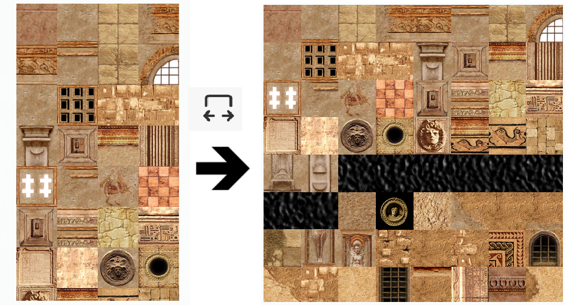

- Open Batch Loader (`Ctrl + W`)

> ⚠️ **Please use Imports carefully and conscientiously when building your own custom levels.**  
> Clarify with the creator whether you are authorised to use custom assets.  
> If in doubt, use assets that are guaranteed to be acceptable for use in your own custom levels instead.  
> This tool is licensed under the MIT licence.

---

## Batch File Loader

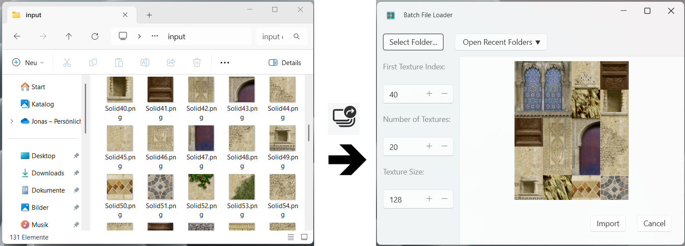

- Import multiple image files from a folder  
  _Supported formats:_ **TGA, DDS, PNG, BMP, JPG, JPEG**
- Select or reopen folder
  - … or simply **drop** a set of supported image files on the preview panel.
- Set Range:
  - **First Texture Index**
  - **Number of Textures**
- Define square resize size for textures

---

## Grid Tab (Source Panel)

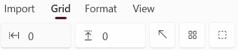

From left to right:
- Set **X offset**
- Set **Y offset**
- Reset offset
- Toggle grid on/off
- Change layout

---

## Format Tab (Source and Destination Panel)

This tab allows you to modify the pixel format of the texture panel. TrLynx fully supports the opening, modification and writing of both **24-bit** and **32-bit** pixel formats.

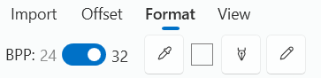

From left to right:
- BPP toggle
- Eyedropper to set color to replace
- Selected color to replace
- Replace selected color with **magenta** or **transparency**
- Auto-apply magenta or transparency replacement for new selections

The BPP toggle is set automatically depending on the input after loading. You can then set it manually if you wish:
- **RGB 24 BPP** — magenta is used for transparent parts
- **BGRA 32 BPP** — a real alpha channel is used

Switching between the two settings will set the pixel values appropriately (e.g. alpha = 0 areas will be converted to magenta areas, and vice versa).

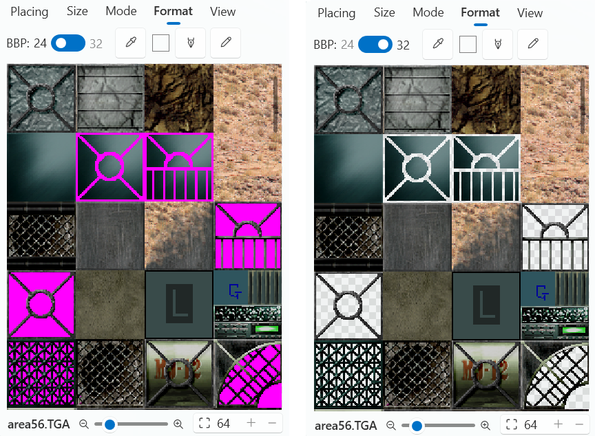

> ⚠️ Switching from **BGRA 32 BPP** to **RGB 24 BPP** will set the magenta colour correctly, but since pixels with an alpha value other than **0** or **255** are not supported by RGB 24 BPP, information will be lost, possibly making the switching step irreversible.

---

## View Tab (Source and Destination Panel)

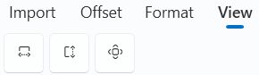

From left to right:
- Fit panel **width** to viewport
- Fit panel **height** to viewport
- Set zoom to **100%**

---

## Placing Tab (Destination Panel)

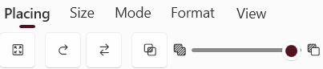

From left to right:
- Enable **Resize to Picker** mode (resize selection to destination picker size)
- Enable **Continuously Placing** mode (does not switch back to Picking mode automatically after placing)
- Enable **Swap and Place** mode (put replaced tile into selection)
- Enable transparent overlay (do not draw magenta/alpha 0 to destination)

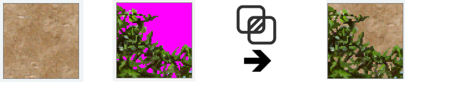

- Set **Opacity** for placed tile

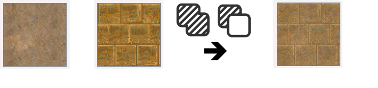

---

## Size Tab (Destination Panel)

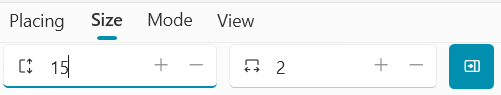

From left to right:
- Set destination panel **height** (in pages, max 128 pages)
- Set destination panel **width** (in pages, possible values: 1, 2, 4, 8, or 16 pages)
- Enable texture **rearranging during width changes**

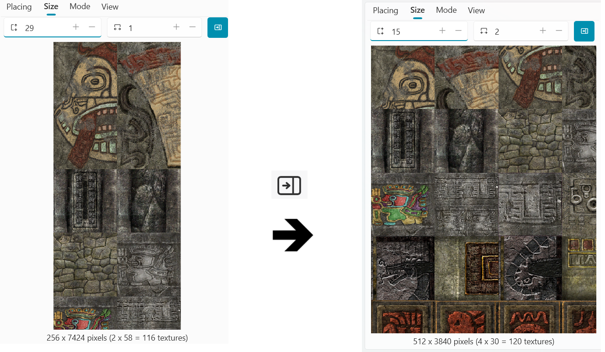

---

## Mode Tab (Destination Panel)

Same functions as in TBuilder.

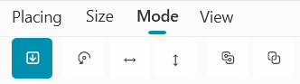

From left to right:
- Standard tile placing
- Rotate tile
- Mirror tile **horizontally**
- Mirror tile **vertically**
- **Tile Rally mode**: move one tile and shift all tiles in between
- **Swap Tile mode**: swap two tiles

---

## Keyboard Shortcuts

| Key Combination    | Description                                          |
|--------------------|------------------------------------------------------|
| Ctrl + A           | Create a new texture panel                           |
| Ctrl + C           | Copy selection to clipboard                          |
| Ctrl + V           | Paste from clipboard to selection                    |
| Ctrl + Z           | Undo                                                 |
| Ctrl + Y           | Redo                                                 |
| Ctrl + S           | Save destination texture panel                       |
| Ctrl + Shift + S   | Save destination texture panel to new / other file   |
| Ctrl + E           | Open source texture panel                            |
| Ctrl + D           | Open destination texture panel                       |
| Ctrl + Q           | Import from TR Level                                 |
| Ctrl + W           | Open batch loader                                    |

---

## Limitations

- The height of any bitmap/texture panel handled by this tool is currently capped at **32,768 px** or **128 pages** (~256 px per page). This limitation is required to avoid issues with the .NET WPF Bitmap containers.
- The height is always a **multiple of 256 px**, the standard TR page width, to ensure divisibility by picker sizes.
- Supported destination texture panel widths: **256, 512, 1024, 2048, 4096 px** (corresponding to 1, 2, 4, 8, and 16 pages).
- Supported picker sizes: **8, 16, 32, 64, 128, 256 px**
- Image files that do not meet these requirements will be **automatically expanded or cropped**. You will always be able to open them.
