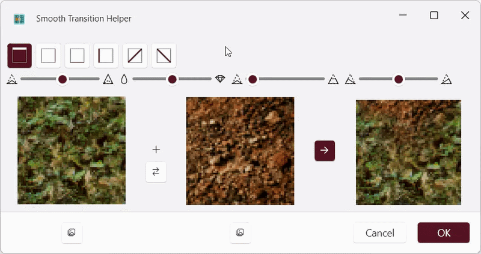
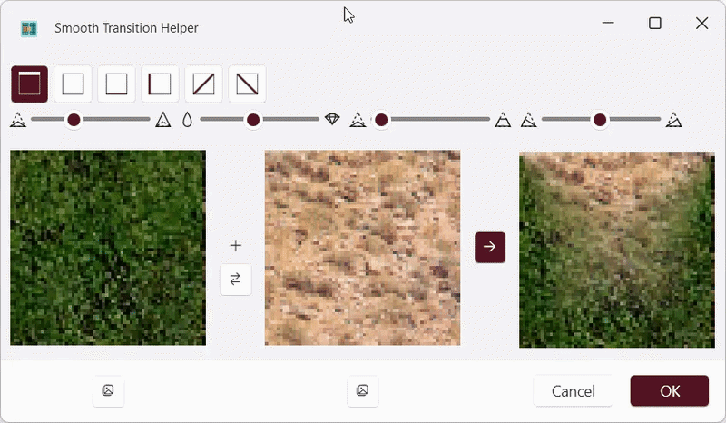
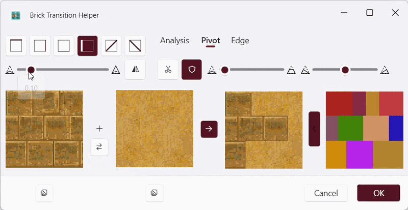
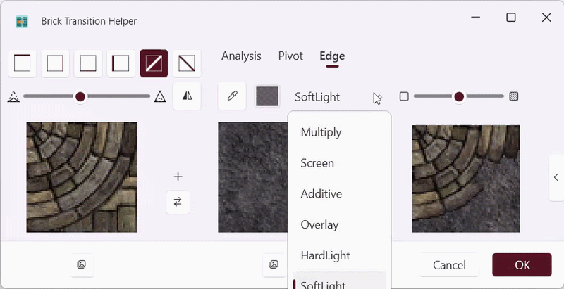

Version 2.2.5 with major transition performance improvements, new controls to manage transition topology, and advanced brick-edge sizing and tinting options.

- Significant performance improvements for transition window calculations. Slider updates now trigger much faster redraws, with little to no visible latency on performant systems.
- New controls to fine-tune transition topology and the brick edge breakup line:
    - **Widening** (`0` to `1`, default `0`): Broadens the transition front from a point into a plateau. This replaces the old offset setting, because the previous offset use case is now covered by widening. At `1`, the side slopes collapse into the texture edges, resulting in a single-line transition. With **Hardness** at `1`, this reproduces the former offset case.
    
    - **Shift** (`-1` to `1`, default `0`): Moves the transition pivot/plateau left or right to create asymmetric transitions. At extreme values, one side slope can collapse into the texture edge.
    
- **Edge protection toggle** improvement: Edge protection can now be explicitly turned off (`false`), allowing workflows where strict border preservation is not desired.

- New **brick edge tinting and sizing** controls:
    - **Edge Width** (`0` to `12`): Controls how wide the edge blending band is, from no edge smoothing to a broader softened edge.
    - **Edge Tint Color**: Lets you choose the tint color applied to edge regions.
    - **Blend/application modes** for edge tinting:
        - **Multiply**: Darkens by multiplying tile and tint colors.
        - **Screen**: Lightens by inverse multiplication.
        - **Additive**: Adds color values for stronger brightening/glow.
        - **Overlay**: Increases contrast by combining multiply and screen behavior.
        - **HardLight**: Strong contrast effect driven by tint values.
        - **SoftLight**: Smoother, more subtle contrast shaping.
        - **ColorDodge**: Strong highlight/brightening effect.
        - **ColorBurn**: Strong shadow/darkening effect.
    
- Fixed an issue where info texts could disappear unexpectedly.
- Various code refactorings for transitions module

---

2. Version 2.2.6 with a new unified Transition window, a fully featured Modifications window, four new brick segmentation methods, new brick transition sections (Shadow, Underfilling, Manual), and quality-of-life additions to the main window.

- **Modifications window** redesigned as a dedicated split-layout dialog (image previews left, scrollable controls right) with three collapsible expanders.
- **Modifications / Basic** expander: **Exposure** (`-5` to `+5`) adjusts overall brightness in photographic stops.
- **Modifications / Basic** expander: **Brightness** (`-1` to `+1`) shifts overall luminosity linearly.
- **Modifications / Basic** expander: **Contrast** (`-1` to `+1`) increases or reduces tonal range.
- **Modifications / Basic** expander: **Highlights** (`-1` to `+1`) recovers or boosts bright tonal regions.
- **Modifications / Basic** expander: **Shadows** (`-1` to `+1`) lifts or crushes dark tonal regions.
- **Modifications / Basic** expander: **Whites** (`-1` to `+1`) clips or expands the brightest point of the image.
- **Modifications / Basic** expander: **Blacks** (`-1` to `+1`) clips or expands the darkest point of the image.
- **Modifications / Color** expander: **Saturation** (`-1` to `+1`) uniformly increases or decreases color intensity.
- **Modifications / Color** expander: **Vibrance** (`-1` to `+1`) boosts muted colors while protecting already-saturated ones.
- **Modifications / Color** expander: **Hue** (`-180` to `+180`) rotates all colors around the color wheel.
- **Modifications / Color** expander: **Temperature** (`-1` to `+1`) shifts the image toward cooler (blue) or warmer (orange) tones.
- **Modifications / Color** expander: **Tint** (`-1` to `+1`) shifts the image toward green (negative) or magenta (positive).
- **Modifications / Color Overlay** expander: eyedropper toggle to sample the overlay color from the input image.
- **Modifications / Color Overlay** expander: color picker to select a single color to blend with the texture.
- **Modifications / Color Overlay** expander: **Overlay Amount** (`0` – `100`) blends the selected color with the texture.
- **Modifications / Color Overlay** expander: **Mix Mode** selector — Linear, Soft Light, or OKLab Chroma.
- **Modifications / Color Overlay** expander: **Luma Preservation** (`0` – `1`) keeps original luminance while transferring overlay chroma (OKLab Chroma mode only).
- **Modifications / Color Overlay** expander: **Chroma Boost** (`0` – `2`) increases or reduces overlay chroma intensity in perceptual color space (OKLab Chroma mode only).
- **Modifications window**: new **Apply** button previews changes without closing the dialog.
- **Smooth and Brick transition windows merged** into a single unified **Transition Helper** window; mode is toggled via radio buttons at the top left.
- **Transition window**: new **Apply** button previews the transition result without closing the dialog.
- **Brick / Analysis**: four new color-based segmentation methods added to the method drop-down — **Felzenszwalb**, **SLIC**, **Quickshift**, and **Grid Fit** — alongside the existing Watershed and Brick Fit.
- **Brick / Analysis / Felzenszwalb**: **Min Size** (`1` – `500`) sets the minimum component size before region merging.
- **Brick / Analysis / Felzenszwalb**: **Scale** (`1` – `500`) sets the merge tolerance scale factor (higher = larger, fewer segments).
- **Brick / Analysis / SLIC**: **Segment Count** (`1` – `2000`) sets the target number of superpixels.
- **Brick / Analysis / SLIC**: **Compactness** (`0.1` – `50`) trades off color similarity against spatial regularity.
- **Brick / Analysis / Quickshift**: **Max Distance** (`1` – `50`) sets the maximum local growth distance from the seed pixel.
- **Brick / Analysis / Quickshift**: **Ratio** (`0.1` – `5`) scales the color similarity threshold.
- **Brick / Analysis / Grid Fit**: **Marker Radius** (`1` – `20`) sets the size of the seed markers.
- **Brick / Analysis / Grid Fit**: **Angle** (`-90` – `+90`) rotates the grid fitting.
- **Brick / Analysis / Watershed**: new **Marker Count** (`#`, `1` – `256`) slider sets the number of seed markers for watershed segmentation.
- **Brick / Analysis / Brick Fit**: new **Angle** (`-90` – `+90`) slider rotates the fitting grid.
- **Brick / Analysis**: new **Gaussian** pre-processing filter option added to the filter drop-down.
- **Brick / Analysis / Gaussian filter**: **σ** slider (`0.1` – `20`) controls the blur radius.
- **Brick / Shadow** expander (new): eyedropper toggle to sample the shadow color from the result image.
- **Brick / Shadow** expander: color picker to select the shadow color drawn over the background behind tile borders.
- **Brick / Shadow** expander: **Shadow Size** (`0` – `32`) sets the maximum shadow extent in pixels from the tile border.
- **Brick / Shadow** expander: **Shadow Hardness** (`0` – `100`) controls how quickly the shadow fades away from tile borders.
- **Brick / Underfilling** expander (new): reverse toggle turns underfilling into overfilling by substituting bright pixels (useful for sandy textures and bright backgrounds).
- **Brick / Underfilling** expander: **Threshold** (`0` – `255`) sets the underfilling intensity (`0` = none, `255` = maximum).
- **Brick / Underfilling** expander: **Pivot** (`0` – `1`) sets the positional bias of the underfilling area.
- **Brick / Manual** expander (new): **Tile Visibility Pen** toggle — draw on the result image to mark tiles as visible.
- **Brick / Manual** expander: **Tile Visibility Eraser** toggle — draw on the result image to mark tiles as hidden.
- **Brick / Manual** expander: **Reset** button clears all manual visibility overrides and reverts to the computed result.
- **Main window / Target panel**: hold **Space** while clicking or dragging to make a free (grid-independent) selection; release Space to return to normal grid-snapped behavior.
- **Main window (Avalonia UI)**: **Copy / Paste** (`Ctrl+C` / `Ctrl+V`) support added.